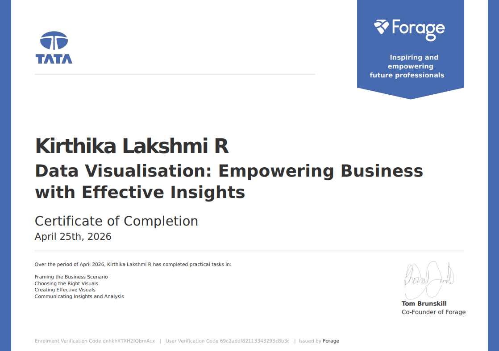

# 📊 Online Retail Sales & Customer Analytics Dashboard (Power BI)

## 🔹 Project Overview

This project presents an end-to-end business analysis of an online retail dataset using Power BI. The dashboard is designed to help senior stakeholders understand revenue performance, customer behavior, and market opportunities through interactive and insight-driven visualizations.

The solution goes beyond basic reporting by incorporating **customer segmentation (RFM analysis)** and **interactive filtering**, enabling deeper exploration of business performance.

---

## 🔹 Business Objectives

* Analyze revenue trends and identify seasonality patterns
* Identify top-performing countries and expansion opportunities
* Understand high-value customers and purchasing behavior
* Segment customers using data-driven techniques (RFM)
* Enable interactive, decision-focused analysis for stakeholders

---

## 🔹 Project Context

This project was completed as part of the **Tata Data Visualisation Virtual Experience Program (Forage)**, simulating real-world business scenarios involving CEO and CMO requirements.

The solution was further enhanced beyond the original task by building a **fully interactive dashboard with advanced analytics features**.

---

## 🔹 Data Preparation & Cleaning

To ensure data quality and reliability:

* Removed records where **Quantity ≤ 0** (returns)
* Removed records where **Unit Price ≤ 0** (invalid entries)
* Handled missing customer values where required
* Created **Revenue column** (Quantity × UnitPrice)

---

## 🔹 Dashboard Features

### 📈 Revenue Performance Analysis

* Monthly revenue trend (seasonality & growth patterns)
* KPI cards: Total Revenue, Orders, Customers, Avg Order Value

---

### 🌍 Geographic Analysis

* Revenue and demand distribution by country
* Identification of high-potential regions for expansion
* Exclusion of UK to focus on international growth

---

### 👤 Customer Analysis

* Top 10 customers by revenue
* Customer contribution to overall business performance

---

### 🧠 RFM Customer Segmentation

Customers are segmented based on:

* **Recency** (last purchase)
* **Frequency** (number of orders)
* **Monetary Value** (total spend)

Segments include:

* High Value
* Loyal Customers
* Regular Customers
* At Risk
* Low Value

This helps in targeted marketing and retention strategies.

---

## 🔹 Interactivity

* Dynamic slicers for:

  * Country
  * Year
  * Customer
* All visuals are interconnected for real-time filtering and analysis

---

## 🔹 Dashboard Preview

---

## 🔹 Project Files

* 📊 [Download Power BI Dashboard](retail_dashboard.pbix)
* 📁 [Download Dataset](Sample_Dataset.xlsx)

---

## 🔹 Tools & Technologies

* **Power BI** (Data modeling, DAX, Visualization)
* **Excel** (Data preprocessing)

---

## 🔹 Dataset Source

UCI Machine Learning Repository
https://archive.ics.uci.edu/

---

## 🔹 Key Insights

* Revenue shows strong seasonal spikes, especially during peak sales periods
* A small segment of customers contributes a significant portion of total revenue
* Certain countries demonstrate high demand, indicating expansion opportunities
* Customer segmentation highlights retention risks and high-value groups

---

## 🔹 Key Learning Outcomes

* Data cleaning and transformation for real-world datasets
* Designing stakeholder-focused dashboards
* Implementing RFM-based customer segmentation
* Building interactive and scalable BI solutions

---

## 🔹 Certification

This project was completed as part of the **Tata Data Visualisation Virtual Experience Program (Forage)**.

---

## 🔹 By

**Kirthika Lakshmi**
