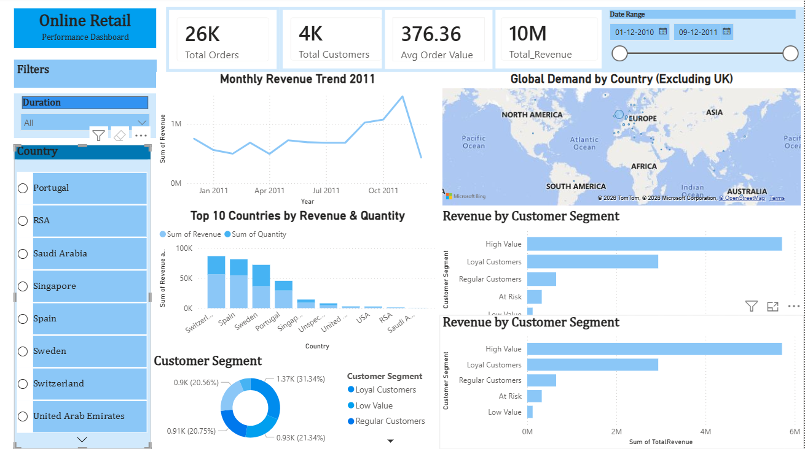

# Online-Retail-Analysis

# 📊 Online Retail Dashboard (Power BI)

## 🔹 Project Overview

This project presents an interactive Power BI dashboard analyzing online retail data to generate business insights for decision-making.

---

## 🔹 Objectives

* Analyze revenue trends over time
* Identify top customers and countries
* Understand product demand
* Perform customer segmentation using RFM analysis

---

## 🔹 Data Cleaning

* Removed records where Quantity ≤ 0
* Removed records where Unit Price ≤ 0
* Created Revenue column (Quantity × UnitPrice)

---

## 🔹 Dashboard Features

### 📈 Revenue Analysis

* Monthly revenue trend
* Seasonal insights

### 🌍 Geographic Analysis

* Revenue and demand by country
* Expansion opportunities

### 👤 Customer Analysis

* Top 10 customers
* Customer contribution

### 🧠 RFM Segmentation

* Categorized customers into:

  * High Value
  * Loyal
  * Regular
  * At Risk
  * Low Value

---

## 🔹 Dashboard Preview

---

## 🔹 Tools Used

* Power BI(retail_dashboard.pbix)
* Excel(Sample_Dataset.xlsx)

---

## 🔹 Dataset Source

UCI Machine Learning Repository
https://archive.ics.uci.edu/

---

## 🔹 Key Insights

* Revenue shows strong seasonal trends
* A small group of customers contributes most revenue
* Certain regions show high demand and growth potential

---

## 🔹 By

Kirthika Lakshmi
